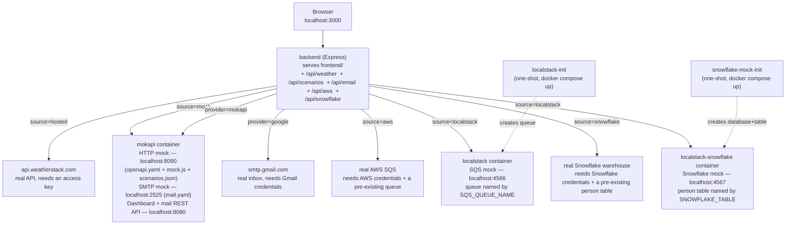

# Mokapi Mocking Demo

A small demo of using local, spec- or config-driven mocks to stand in for
real third-party services, instead of hand-rolling fake servers and poking
them with Postman. Two tools illustrate the same practice for different
protocols — [mokapi](https://mokapi.io/) for REST and SMTP,
[localstack](https://www.localstack.cloud/) for AWS and Snowflake — behind
one UI, four tabs, each toggleable against the real thing:

- **REST API tab** — [weatherstack](https://docs.apilayer.com/weatherstack/docs/weatherstack-api-v-1-0-0)'s
  "current weather" endpoint, mocked from an OpenAPI spec via mokapi, vs. the
  real hosted API.
- **Email tab** — SMTP email, mocked by mokapi's built-in mail server, vs.
  real Gmail SMTP.
- **AWS tab** — sends a message to an SQS queue, mocked locally via
  [localstack](https://www.localstack.cloud/)'s AWS emulator, vs. a real
  hosted SQS queue.
- **Snowflake tab** — CRUD on a `person` table, mocked locally via
  [LocalStack for Snowflake](https://www.localstack.cloud/localstack-for-snowflake),
  vs. a real Snowflake warehouse.

## Why this matters

This repo exists to make a case for a practice, not for a particular tool.
mokapi is just what's used here to make the idea concrete enough to try.
The practice: local and some test environments should talk to a controlled,
spec-driven mock of a dependency, not to that dependency's hosted
instance.

- **Test environments shouldn't depend on production.** Pointing local dev
  or test at a real third party — or at your own production systems — means
  every test run has a real side effect (a real email sent, a real quota
  spent) and is only as reliable as someone else's uptime. A mock removes
  that dependency entirely: nothing leaves your machine, nothing costs
  anything, nothing can be down or rate-limited.
- **You can't test what you can't trigger.** How do you check that your app
  handles an error response, a malformed payload, or an edge-case value, if
  you can't make the real dependency produce that on demand? A mock lets you
  script the exact scenario you need, instantly and repeatably, instead of
  waiting for a real failure to happen to you.
- **Testing a scenario shouldn't require touching code or a deploy.** In this
  demo, adding a new test case is a form in a browser — no code change, no
  restart, nothing to ship. That's the difference between "mocking is
  technically possible" and "mocking is something people actually reach
  for."
- **A mock is only trustworthy if it can't drift from the real contract.**
  Hand-rolled fake-server code tends to quietly diverge from what the real
  API actually does over time. Generating the mock from the same spec
  (OpenAPI here) you'd hand to a consumer of the real API keeps the two
  honest with each other.
- **None of this is specific to mokapi.** Other tools take the same
  approach. What matters is the shift itself — from "point everything at the
  real thing and hope" to "mock what you don't control, on purpose."

## Architecture



The backend never exposes which source answered a weather lookup — it
normalizes both into the same `{status, ...}` shape before the frontend ever
sees it. Scenario saves from the UI write straight into
`mokapi/scenarios.json`, which both the backend (writer) and mokapi (reader)
see via the same bind-mounted host file, so there's no restart or polling
involved. For email, the same mokapi container also runs an SMTP mock
server (defined in `mokapi/mail.yaml`) alongside the HTTP mock — the backend
sends to it over real SMTP, and reads captured messages back through
mokapi's mail REST API. For AWS, a separate `localstack` container mocks
SQS — its queue is created by a one-shot `localstack-init` service on
`docker compose up`, not by the backend, so the backend's job for both
sources is identical: resolve an already-existing queue (never create one)
and send to it, using localstack's dummy credentials for the mock and the
AWS SDK's default credential chain for the real one. Reading messages back
for review only exists for the Localstack source. It's destructive (matches
a real consumer — reading removes the message from the queue), so the
backend keeps a short in-memory history of the last 5 messages it's
consumed to display, since the queue itself has nothing left to re-check.
For Snowflake, a separate `localstack-snowflake` container (a different
LocalStack product from the SQS one, with its own license requirement — see
below) mocks a Snowflake warehouse; its database and `person` table are
created by a one-shot `snowflake-mock-init` service on `docker compose up`,
the same pattern as `localstack-init` for SQS. The backend runs the same
parameterized `SELECT`/`INSERT`/`UPDATE`/`DELETE` queries against either
source, differing only in connection details.

## Demo script

The fastest way to see what this is about, in order:

1. **Look up "Chicago" with Mokapi selected.** You get "Success! City:
   Chicago, Temperature: 999°F" — an obviously fake number, which is the
   point: it proves the response came from the local mock, not a live
   weather service.
2. **Open the Mokapi Dashboard** (button top-right, or `localhost:8080`).
   Show the request you just made in the live log — this is the moment that
   makes the "we're not hand-rolling a fake server" pitch land: mokapi is a
   real service, generating real HTTP traffic, from a spec.
3. **Add a new scenario** in the UI for a city that doesn't exist yet:
   Response Code `400`, Error Code `615`, Error Info `Unable to geocode this
   location.`. Save it, then look that city up — you get the error rendering
   immediately, no restart.
4. **Open `mokapi/scenarios.json`** on disk and point out the scenario you
   just added is sitting there as plain JSON — nothing magic, no database.
5. **Toggle to Weatherstack (hosted)** and look up a real city (needs
   `WEATHERSTACK_ACCESS_KEY` set) to show the exact same UI, unmodified,
   working against the real API — same contract, same code path.
6. **Open `mokapi/openapi.yaml`** to close the loop: this one file is the
   entire contract driving the mock, and it's the same shape you'd hand
   anyone as documentation for the real API.
7. **Switch to the Email tab.** Send a message with **Mokapi** selected and
   watch the **Mokapi Inbox** panel fill in with the exact Subject/From/To
   and body mokapi's mock SMTP server received — real SMTP traffic, just
   like the REST tab's real HTTP traffic, visible in the same Mokapi
   Dashboard.
8. **Switch Send via to Google and resend** (needs `GMAIL_USER`/
   `GMAIL_APP_PASSWORD` set). The backend sends it for real via Gmail SMTP
   this time — check that email account's actual inbox to confirm the
   message arrived. Same UI, same form, same code path as step 7; only the
   destination changed. The Mokapi Inbox panel doesn't apply here, since
   nothing went through the mock.
9. **Open `mokapi/mail.yaml`** to show the mail-mocking contract is just as
   small and declarative as `openapi.yaml` was for REST.
10. **Switch to the AWS tab.** Send a message with **Localstack** selected
    (needs `LOCALSTACK_AUTH_TOKEN` set) and watch the **Localstack Queue**
    panel fill in with the exact message body localstack's mock SQS queue
    received — same "proof, not simulated" beat as the REST and Email tabs,
    this time for a completely different tool (localstack instead of
    mokapi), making the point that the practice matters more than any one
    tool.
11. **Switch Send via to AWS (real SQS) and resend** (needs
    `AWS_ACCESS_KEY_ID`/`AWS_SECRET_ACCESS_KEY`/`AWS_REGION` set, and a real
    queue named to match `SQS_QUEUE_NAME` already provisioned). The backend
    sends it for real via the AWS SDK this time — check the AWS SQS console
    to confirm the message arrived. The Localstack Queue panel doesn't apply
    here, since nothing went through the mock.
12. **Switch to the Snowflake tab** (with **Localstack** selected — needs a
    `LOCALSTACK_AUTH_TOKEN` entitled to LocalStack for Snowflake
    specifically, a separate license from the AWS tab's; see "Getting a
    LocalStack for Snowflake token" below). Add a row with **+**, fill in
    First/Last Name and Favorite Color, and **save** it (floppy-disk icon) —
    it's now a real row in the mock's `person` table. Double-click a cell to
    edit it in place, then save again to update it.
13. **Switch Source to Snowflake (real)** (needs `SNOWFLAKE_ACCOUNT`/
    `SNOWFLAKE_USERNAME`/`SNOWFLAKE_PASSWORD`/`SNOWFLAKE_WAREHOUSE`/
    `SNOWFLAKE_DATABASE` set, and a real `person` table already provisioned
    — see "Provisioning the real Snowflake table"). The exact same UI, same
    queries, now run against a real warehouse — check it directly (Snowsight
    or `snowsql`) to confirm the row landed. Same point as steps 5 and 11:
    the practice generalizes past any one tool or protocol.

## Prerequisites

- Docker Desktop (or another Docker Engine + Compose)
- A free [weatherstack](https://weatherstack.com/) access key — **only
  required if you want to try the REST API tab's "hosted" source**. The
  mock source works with no key at all.
- A Gmail address + App Password — **only required if you want to try the
  Email tab's "Google" option**. The "Mokapi" option works with no
  credentials at all.
- A free [localstack](https://app.localstack.cloud/) account + auth token —
  **required for the AWS tab's "Localstack" option**. As of March 2026,
  localstack's Docker image won't start at all without one (no paid plan
  needed, just a signup).
- Real AWS credentials + a pre-existing SQS queue — **only required if you
  want to try the AWS tab's "AWS (real SQS)" option**.
- A [LocalStack for Snowflake](https://www.localstack.cloud/localstack-for-snowflake)
  trial or paid token — **required for the Snowflake tab's "Localstack"
  option**. This is a *separate product* from the base localstack account
  above; the free SQS token does not cover it. A 30-day free trial (no card
  required) is available.
- Real Snowflake credentials (account, user, password, warehouse) + a
  pre-existing `person` table — **only required if you want to try the
  Snowflake tab's "Snowflake (real)" option**.

## Adding your credentials

```bash
cp .env.example .env
```

Edit `.env` and set whichever of these you need — each is independent of the
others. All are optional **except** `LOCALSTACK_AUTH_TOKEN`, which is
required if you want the AWS tab's "Localstack" option to work at all (the
`localstack` container won't start without it); everything else only
gates one specific "real" option and the rest of the app works fine
without it:

```
WEATHERSTACK_ACCESS_KEY=your-key-here
GMAIL_USER=you@gmail.com
GMAIL_APP_PASSWORD=your-16-character-app-password
SQS_QUEUE_NAME=mokapi-demo-queue
LOCALSTACK_AUTH_TOKEN=your-localstack-token
AWS_ACCESS_KEY_ID=your-access-key-id
AWS_SECRET_ACCESS_KEY=your-secret-access-key
AWS_REGION=us-east-1
SNOWFLAKE_TABLE=person
SNOWFLAKE_ACCOUNT=your-account-identifier
SNOWFLAKE_USERNAME=your-snowflake-username
SNOWFLAKE_PASSWORD=your-snowflake-password
SNOWFLAKE_WAREHOUSE=your-warehouse-name
SNOWFLAKE_DATABASE=your-database-name
SNOWFLAKE_SCHEMA=PUBLIC
```

Note that `LOCALSTACK_AUTH_TOKEN` above is required twice over for two
*different* reasons: once for the AWS tab's "Localstack" option (any free
account works), and again for the Snowflake tab's "Localstack" option —
which needs that same token to additionally be entitled to LocalStack for
Snowflake specifically (a separate paid product/trial). See "Getting a
LocalStack for Snowflake token" below.

`.env` is gitignored — credentials are only ever passed into the backend
container as environment variables, never baked into an image or committed.

### Getting a weatherstack access key

Only needed for the REST API tab's "Weatherstack (hosted)" source.

1. Go to [weatherstack.com](https://weatherstack.com/) and click **Get Free
   API Key** (or sign up via [apilayer.com](https://apilayer.com/), which
   also hosts weatherstack).
2. Verify your email and log in to the dashboard.
3. Copy the **API Access Key** shown there into `WEATHERSTACK_ACCESS_KEY`.
   The free tier is plenty for this demo (no card required, generous
   monthly request limit).

### Getting a Gmail App Password

Only needed for the Email tab's "Google (real SMTP)" option.

1. Turn on **2-Step Verification** on the Google account you want to send
   from, if it isn't already: [myaccount.google.com/security](https://myaccount.google.com/security) →
   **2-Step Verification**. App Passwords aren't available without this.
2. Go to [myaccount.google.com/apppasswords](https://myaccount.google.com/apppasswords).
3. Under **App name**, type something like `Mokapi Email Demo` and click
   **Create**.
4. Google shows a 16-character password (four groups of four letters, e.g.
   `abcd efgh ijkl mnop`) — copy it as-is (spaces are fine) into
   `GMAIL_APP_PASSWORD`.
5. Set `GMAIL_USER` to the full Gmail address of that same account (the one
   whose App Password you just generated) — this is both the SMTP login and
   the "from" address the demo sends as.

This is **not** your normal Gmail password, and can't be used to log into
the account itself — it only authorizes SMTP/IMAP access for this one app,
and can be revoked independently from the same App Passwords page at any
time without affecting your main password.

### Getting a localstack auth token

Required for the AWS tab's "Localstack" option — since March 2026,
localstack's Docker image runs a license check on startup and won't start
without a valid token, even for community-tier services like SQS. No paid
plan needed.

1. Go to [app.localstack.cloud](https://app.localstack.cloud/) and sign up
   for a free account.
2. In the web app, generate an auth token (under account/API settings).
3. Copy it into `LOCALSTACK_AUTH_TOKEN` in `.env`.

### Provisioning the real SQS queue

Only needed for the AWS tab's "AWS (real SQS)" option. The backend never
creates a queue in a real AWS account — that's a deliberate choice to avoid
an app quietly provisioning billable resources as a side effect. (The
Localstack option's queue is also never created by the backend — it's
provisioned by a one-shot `localstack-init` service in `docker-compose.yml`
instead, so queue provisioning is consistently an infra concern for both
sources, not something the integration layer does at request time.)

1. In the AWS account/region you want to use, create a standard (non-FIFO)
   SQS queue named to match `SQS_QUEUE_NAME` in `.env` (default
   `mokapi-demo-queue`) — via the SQS console, `aws sqs create-queue
   --queue-name mokapi-demo-queue`, or your infra-as-code tool of choice.
2. Set `AWS_ACCESS_KEY_ID`, `AWS_SECRET_ACCESS_KEY`, and `AWS_REGION` in
   `.env` to credentials with `sqs:GetQueueUrl` and `sqs:SendMessage`
   permission on that queue — a static access key from an IAM user's
   "Security credentials" tab is enough; leave `AWS_SESSION_TOKEN` blank
   for that. Only set `AWS_SESSION_TOKEN` if you're using temporary
   credentials instead (an assumed role, SSO, or an MFA session token).

### Getting a LocalStack for Snowflake token

Required for the Snowflake tab's "Localstack" option. LocalStack for
Snowflake is a **separate product** from the base localstack image the AWS
tab uses — a free SQS-only token will make the `localstack-snowflake`
container fail its own license check with the same "License activation
failed" error the AWS tab's `localstack` container shows without a token
at all.

1. Go to [localstack.cloud/start-snowflake-trial](https://www.localstack.cloud/start-snowflake-trial)
   and start the 30-day free trial (no card required) — or use an existing
   paid LocalStack for Snowflake plan if you have one.
2. In the LocalStack web app, generate/copy an auth token entitled to the
   Snowflake product (same place as the base `LOCALSTACK_AUTH_TOKEN` above).
3. Set it as `LOCALSTACK_AUTH_TOKEN` in `.env` — this repo reuses the same
   variable for both the AWS and Snowflake tabs' Localstack options (see
   "Adding your credentials" above), so this token needs to be entitled to
   *both* if you want both tabs' mock options working at once.

### Provisioning the real Snowflake table

Only needed for the Snowflake tab's "Snowflake (real)" option. The backend
never creates the table — same "provisioning is the user's job, not the
integration layer's" policy as the AWS tab's real SQS queue.

1. In the Snowflake database/schema you want to use, create the table named
   to match `SNOWFLAKE_TABLE` in `.env` (default `person`):
   ```sql
   CREATE TABLE person (
       first_name VARCHAR(50),
       last_name VARCHAR(50),
       favorite_color VARCHAR(30)
   );
   ```
   No primary key is created on purpose — see "Known limitation: no formal
   primary key" below.
2. Set `SNOWFLAKE_ACCOUNT`, `SNOWFLAKE_USERNAME`, `SNOWFLAKE_PASSWORD`,
   `SNOWFLAKE_WAREHOUSE`, `SNOWFLAKE_DATABASE`, and `SNOWFLAKE_SCHEMA`
   (default `PUBLIC`) in `.env` to a user with `SELECT`/`INSERT`/`UPDATE`/
   `DELETE` on that table and `USAGE` on that warehouse. Password auth must
   be enabled for that user — this demo doesn't support key-pair or SSO
   auth.

## Running it

```bash
docker compose up --build
```

Then open:

- **App**: http://localhost:3000
- **Mokapi dashboard**: http://localhost:8080 — watch live mock requests/responses in real time (both HTTP and mail)
- **Mokapi mock weather API directly**: http://localhost:8090/current
- **Mokapi mock SMTP server directly**: `localhost:2525` (any SMTP client)
- **Localstack SQS endpoint directly**: `localhost:4566` (any AWS SDK/CLI
  pointed at it with dummy credentials)
- **LocalStack for Snowflake endpoint directly**: `localhost:4567` (the
  Snowflake Node.js/Python driver, SnowSQL, or DBeaver, pointed at it with
  `account/user/password: test`)

## Using the UI

Use the **REST API** / **Email** / **AWS** / **Snowflake** tabs at the top
to switch between the four modules.

### REST API tab

1. Enter a US city and pick a source, then **Get Weather**.
   - On success you'll see a success message, the city name, and the
     temperature in Fahrenheit — nothing else.
   - On error (mock only returns 400s; hosted may return other codes) you'll
     see the HTTP status, the upstream error code, and the error info message
     — nothing else.
2. Use **Manage Test Scenarios** to define what the mock returns for a given
   city:
   - Pick **Response Code** `200` or `400` (default `200`).
   - `200` scenarios ask for **City Name** and **Temperature**.
   - `400` scenarios ask for **Error Code** and **Error Info**.
   - Saving writes the scenario straight into `mokapi/scenarios.json` — mokapi
     picks it up on the very next request, no restart required.
   - A city with no scenario defined falls back to a generic 70°F success
     response, so the mock never hard-fails on an unrecognized city.
   - Saving shows a brief "Saved scenario for…" confirmation, and the table
     updates immediately with color-coded response-code badges.
   - Click any row in the table to load that scenario back into the form for
     editing — rows highlight on hover to show they're clickable. Saving
     again overwrites that same city's scenario (keys are lowercased city
     names, so this is always an update-in-place, never a duplicate).

The repo ships with one seeded scenario: `chicago` → 200, temperature 999°F.

### Email tab

1. Enter a **To** address, write a **Body**, pick **Mokapi** or **Google**
   under **Send via**, then **Send**.
2. With **Mokapi** selected, the message is sent over real SMTP to mokapi's
   local mock server — nothing leaves your machine. The **Mokapi Inbox**
   panel below then automatically checks mokapi's mail API for the message
   it just captured and displays the raw Subject/From/To/body in a
   plain-text, monospaced box. Use **Refresh** to re-check manually (e.g. if
   you switch the **To** address).
3. With **Google** selected, the message is sent for real via Gmail SMTP
   using `GMAIL_USER`/`GMAIL_APP_PASSWORD` from `.env` — check the actual
   inbox at that address to see it arrive. The Mokapi Inbox panel doesn't
   apply here, since nothing went through the mock.

### AWS tab

1. Write a **Message Body**, pick **Localstack** or **AWS** under **Send
   via**, then **Send**.
2. With **Localstack** selected (needs `LOCALSTACK_AUTH_TOKEN` set — see
   "Getting a localstack auth token" above, or the `localstack` container
   won't start), the message is sent to a local SQS queue running in the
   `localstack` container — nothing leaves your machine. The queue (named
   by `SQS_QUEUE_NAME`) is created by the `localstack-init` service in
   `docker-compose.yml`, once, when you run `docker compose up` — not by
   the backend. The **Localstack Queue** panel below then automatically
   checks the mock queue for the message it just sent and displays it
   (plus its message ID) in a plain-text, monospaced, scrollable box, the
   same way the Mokapi Inbox panel does for email. Use **Refresh** to
   re-check manually. This read is **destructive** — matching how a real
   SQS consumer works, reading a message removes it from the queue for
   good — so what's shown is a short history of the last 5 messages the
   backend has consumed, most recent first, not a live view of the queue's
   current contents.
3. With **AWS** selected, the message is sent for real to the SQS queue
   named by `SQS_QUEUE_NAME` using `AWS_ACCESS_KEY_ID`/
   `AWS_SECRET_ACCESS_KEY`/`AWS_REGION` from `.env` — check the AWS SQS
   console or CLI to see it arrive. This demo never creates a real queue for
   you; sending will fail with a clear error if the queue doesn't already
   exist. The Localstack Queue panel doesn't apply here, since nothing went
   through the mock.

### Snowflake tab

1. Pick **Localstack** or **Snowflake (real)** under **Source**. The table
   below shows every row currently in the `person` table for that source.
   There's no automatic polling — click **Refresh** to reload it, or take
   any of the actions below, which each reload it for you afterward.
2. **Filter**: type a value into **First Name** and click **Filter** to run
   a `WHERE first_name = ...` query. This only affects that one query —
   **Refresh**, **Clear**, and every save/delete revert to showing all
   records. **Clear** resets the First Name field and reloads the
   unfiltered table in one click.
3. **Select a row** by clicking it (it highlights).
4. **Edit a cell** by double-clicking it — it turns into a text box; press
   Enter or click elsewhere to commit, or Escape to cancel. Editing doesn't
   save anything by itself — nothing is sent to the server until you click
   the floppy-disk (save) icon that appears in the selected row's own last
   column. If you select a different row (or add another one) while a row
   still has unsaved changes, that row turns amber — a reminder that it
   still needs to be saved. **Refresh**/**Filter**/**Clear**/switching
   **Source** all reload from the server but carry any unsaved row(s)
   forward rather than discarding them.
5. **Add a row** with the **+** button above the table — this adds a blank,
   client-side-only row and selects it. Fill in its cells, then click the
   floppy-disk icon to actually insert it (an unsaved row that's deleted
   instead is just discarded locally, no request sent).
6. **Save** (floppy-disk icon) either inserts a new row (if added via **+**)
   or updates an existing one, matching it by its *original* First/Last
   Name — so renaming a row's name and saving still finds and updates the
   right row, rather than inserting a duplicate.
7. **Delete** a row either with the **&minus;** button above the table or
   the trash-can icon in the selected row itself — both do the same thing.
   There's no confirmation prompt; deleting is immediate. Neither icon is
   ever shown when the table has no records — there's no row to attach
   them to.
8. The **Presets** box (bordered, to the right of the table) has three
   shortcuts for step 5 — each adds a row the same way **+** does (blank,
   client-side-only, selected, still requires the floppy-disk icon to
   actually save), just with some cells pre-filled:
   - **Kung Fu Panda** sets First Name to `Jack`, Last Name to `Black`, and
     Favorite Color to `White` (Po is voiced by Jack Black, and pandas are
     black *and* white).
   - **Randomize** fills all three fields from static pick-lists in
     `frontend/app.js` (`SNOWFLAKE_RANDOM_FIRST_NAMES`/`_LAST_NAMES`/`_COLORS`)
     — edit those arrays directly to change what it can generate.
   - **Another Schlechte** sets First Name to `No` and Last Name to `Way`,
     leaving Favorite Color for you to fill in.

With **Localstack** selected (needs `LOCALSTACK_AUTH_TOKEN` entitled to
LocalStack for Snowflake — see "Getting a LocalStack for Snowflake token"
above, or the `localstack-snowflake` container won't start), all of the
above runs against a local mock warehouse — nothing leaves your machine.
Its `person` table (named by `SNOWFLAKE_TABLE`) is created by the
`snowflake-mock-init` service in `docker-compose.yml`, once, when you run
`docker compose up` — not by the backend. With **Snowflake (real)**
selected, the exact same actions run for real against the warehouse named
by `SNOWFLAKE_DATABASE`/`SNOWFLAKE_WAREHOUSE`/`SNOWFLAKE_SCHEMA` — check it
directly (Snowsight, `snowsql`, or any SQL client) to confirm changes
landed. This demo never creates the real table for you; see "Provisioning
the real Snowflake table" above.

## Manual scenario editing

`mokapi/scenarios.json` is a plain JSON flat file, keyed by lowercased city
name:

```json
{
  "chicago": { "responseCode": 200, "cityName": "Chicago", "temperature": 999 },
  "miami": { "responseCode": 400, "errorCode": 615, "errorInfo": "Unable to geocode this location." }
}
```

You're welcome to hand-edit this file directly instead of using the UI —
mokapi re-reads it on every request, so changes are picked up immediately
with the containers still running.

## Known limitation: hosted error detection

The backend classifies a response as success/error purely by HTTP status
code (2xx vs. everything else), matching the stated acceptance criteria.
Some APIs in the apilayer family have, in the past, returned HTTP 200 with a
`success: false` body even for error cases. If weatherstack's hosted API
ever does that, the hosted path in this demo would misread it as a success.
The mock path is unaffected, since mokapi is explicitly told to return a
literal 200 or 400. If you hit this in practice, the fix is a small change
to `backend/src/normalize.js` to also check `body.success === false`.

## Known limitation: no formal primary key

The `person` table has no primary key — `first_name` + `last_name` are
treated as a de facto key by the UI and by the `UPDATE`/`DELETE` queries,
but nothing in the schema enforces uniqueness. If two rows share the same
first and last name, an update or delete targeting one could affect both.
This is a deliberate, accepted trade-off for this demo, not an oversight.

## Troubleshooting

- **`GET http://localhost:8090/` returns 404.** Expected — mokapi's mock
  only defines `/current` (per `mokapi/openapi.yaml`), not a root route. The
  app itself is on `localhost:3000`; port 8090 is the raw mock API for
  `/current` requests only.
- **Mock lookups always return the generic 70°F fallback, even for a city
  you've defined a scenario for.** Check the mokapi container logs
  (`docker compose logs mokapi`). This previously happened here due to a
  script bug (see [CLAUDE.md](CLAUDE.md#gotchas-hit-during-initial-verification))
  — if `mock.js` has been edited since, that's the first place to look.
- **Hosted lookups fail immediately.** Confirm `.env` has
  `WEATHERSTACK_ACCESS_KEY` set and that `docker compose` picked it up
  (`docker compose config` will show the resolved value).
- **Port already in use.** 3000, 8080, 8090, 2525, 4566, or 4567 already
  bound locally? Change the host-side port in `docker-compose.yml` (left
  side of the `"host:container"` mapping) — no code changes needed.
- **Mokapi Inbox always shows "No message captured yet", even right after a
  successful Mokapi send.** First hit **Refresh** once or twice — local
  delivery is near-instant but not synchronous with the send response. If it
  never appears, check `docker compose logs mokapi` for SMTP errors, and
  confirm `MOKAPI_MAIL_SERVICE_TITLE` in `docker-compose.yml` still matches
  `info.title` in `mokapi/mail.yaml` exactly (`Mokapi Email Demo`) — a
  mismatch makes every inbox lookup silently come back empty.
- **Google send fails immediately with a credentials error.** Confirm
  `.env` has both `GMAIL_USER` and `GMAIL_APP_PASSWORD` set, and that the
  app password (not your regular Gmail password) was generated at
  [myaccount.google.com/apppasswords](https://myaccount.google.com/apppasswords).
- **AWS (real SQS) send fails with "does not exist".** The queue named by
  `SQS_QUEUE_NAME` hasn't been provisioned in that AWS account/region yet —
  this demo never creates it for you. See "Provisioning the real SQS queue"
  above.
- **AWS (Localstack) send fails with "does not exist" the first time you
  run `docker compose up`.** The `localstack-init` service (which creates
  the queue) hadn't finished yet when you sent — check
  `docker compose logs localstack-init`; it should show a `QueueUrl` on
  success. It only runs after `localstack`'s healthcheck passes, which can
  take a few seconds after `localstack` itself starts.
- **AWS (Localstack) send fails with a raw "The specified queue does not
  exist" error after you `docker compose restart localstack` on its own.**
  Expected — `localstack`'s queue state is in-memory only, so restarting it
  alone wipes the queue `localstack-init` created earlier, and that service
  doesn't automatically re-run just because `localstack` restarted. Fix:
  run `docker compose up localstack-init` (recreates the queue; no backend
  restart needed — SQS queue URLs are deterministic by name, so the
  backend's already-cached URL becomes valid again automatically).
- **Localstack Queue always shows "No message captured yet", even right
  after a successful Localstack send.** First hit **Refresh** once or
  twice — local delivery is near-instant but not synchronous with the send
  response. If it never appears, check `docker compose logs localstack` for
  errors.
- **`localstack` container exits immediately with "License activation
  failed".** `LOCALSTACK_AUTH_TOKEN` is missing or invalid in `.env` —
  since March 2026, `localstack/localstack:latest` requires a valid token
  just to start, even for community-tier services like SQS. See "Getting a
  localstack auth token" above; it's a free signup, no paid plan needed.
  Note this also blocks `localstack-init` (and therefore the Localstack
  queue) from ever running, but does **not** block the rest of the app —
  REST API and Email tabs work fine regardless.
- **AWS (real SQS) send fails with a credentials error.** Confirm `.env`
  has `AWS_ACCESS_KEY_ID`, `AWS_SECRET_ACCESS_KEY`, and `AWS_REGION` set,
  and that `docker compose` picked them up (`docker compose config` will
  show the resolved values) — they're passed through to the backend
  container untouched, so the AWS SDK's default credential chain can see
  them.
- **`localstack-snowflake` container exits immediately with "License
  activation failed".** `LOCALSTACK_AUTH_TOKEN` is missing entirely. See
  "Getting a LocalStack for Snowflake token" above. Blocks
  `snowflake-mock-init` (and therefore the Snowflake tab's Localstack
  option) but not the rest of the app.
- **`localstack-snowflake` logs "The Snowflake emulator is currently not
  covered by your license" and exits, even though `LOCALSTACK_AUTH_TOKEN`
  is set.** The license itself activated fine (you'll see "Successfully
  requested and activated new license ...:freemium" just above it) — this
  token isn't entitled to LocalStack for Snowflake specifically, a separate
  product from the base/SQS tier. Confirmed live: a freemium token that
  starts the AWS tab's `localstack` container cleanly still hits exactly
  this error on `localstack-snowflake`. See "Getting a LocalStack for
  Snowflake token" above. **If you just started the trial and still see
  this**, it may be entitlement propagation lag rather than anything
  actually wrong — confirmed live this can persist across several clean
  `docker compose down` + `up -d` cycles (each doing a real, non-cached
  license check) before suddenly resolving to `:trial`. Worth waiting a
  few minutes and retrying with a clean recreate before assuming the token
  itself is the problem.
- **Snowflake tab shows "Timed out connecting after 8s" (Localstack) or an
  immediate "Invalid account" error (Snowflake real).** Both are expected,
  fast-failing errors, not hangs — this app deliberately wraps the
  Snowflake driver's connection attempt in its own short timeout, since the
  driver's own retry logic can otherwise take up to 5 minutes to give up
  (see [CLAUDE.md](CLAUDE.md#snowflake-mocking-facts-localstack-for-snowflake)
  for why). For Localstack, check `docker compose logs localstack-snowflake`
  and `docker compose logs snowflake-mock-init` — the latter should show
  "Mock Snowflake table ready" on success. For real Snowflake, double-check
  `SNOWFLAKE_ACCOUNT` — it's not your username or a URL, but the account
  identifier segment (e.g. `xy12345.us-east-1` or `orgname-accountname`).
- **`snowflake-mock-init` hangs indefinitely (never exits) with the last
  log line "authentication successful using: SNOWFLAKE", and
  `localstack-snowflake`'s own logs show repeated
  `POST /session/v1/login-request => 200` at growing intervals.** This is
  `snowflake-sdk` silently retrying a login it never considers complete —
  confirmed live this happens when `localstack-snowflake` falls back to
  its default hostname instead of recognizing the `localstack-snowflake`
  container name (check its logs for `SF_HOSTNAME_REGEX is deprecated`).
  Make sure `docker-compose.yml` sets `SF_HOSTNAMES: localstack-snowflake`
  (not the deprecated `SF_HOSTNAME_REGEX`) on the `localstack-snowflake`
  service, and that its logs show
  `Snowflake hostname config: hostnames=['localstack-snowflake']` — if
  they instead show `hostnames=['snowflake.localhost.localstack.cloud']`,
  that's this exact problem.
- **Real Snowflake fails fast with "Request to Snowflake failed."** This is
  an HTTP-level rejection from Snowflake itself — confirmed live that it's
  not a network/connectivity/DNS problem (a plain HTTPS request to the same
  `<account>.snowflakecomputing.com` host succeeds from inside the backend
  container). Most likely causes: wrong `SNOWFLAKE_PASSWORD`, a Snowflake
  network policy blocking the connection's source IP, or MFA/Duo required
  on that user (which password-only auth can't satisfy — see "Things
  intentionally left simple" in [CLAUDE.md](CLAUDE.md) on why this demo
  doesn't support key-pair/MFA auth). Double-check the password first; if
  that's confirmed correct, check the user's network policy and
  authentication requirements in Snowflake directly.
- **Snowflake tab's table stays stuck on "Loading…" or a stale row
  reappears after a failed save.** Click **Refresh** — a failed
  save/delete/edit leaves the previous state on screen deliberately (so you
  don't lose in-progress edits), but a plain data-load failure clears the
  table rather than show stale rows as if they were real. If a row you
  never saved (added via **+**) disappears after a failed refresh, that's
  expected: it was never persisted, so there was nothing real to preserve.

## Project layout

```
backend/         Express API + static frontend host
frontend/        Native HTML/CSS/JS UI, no build step, tabbed REST API / Email / AWS / Snowflake pages
mokapi/          OpenAPI spec + JS scenario handler + scenarios.json (REST mock),
                 mail.yaml (SMTP mock)
snowflake-init/  One-shot Node script + Dockerfile that creates the Snowflake
                 mock's database/table on `docker compose up` (mirrors
                 localstack-init's role for the AWS tab's SQS queue)
```

The `localstack` container (SQS mock) needs no config files of its own —
its queue (named by `SQS_QUEUE_NAME`) is created by the one-shot
`localstack-init` service in `docker-compose.yml`, not by application code.
Same pattern for the `localstack-snowflake` container (Snowflake mock) and
`snowflake-init/`'s one-shot `snowflake-mock-init` service, which creates
its database/table (named by `SNOWFLAKE_TABLE`).

See [CLAUDE.md](CLAUDE.md) for the internal contract and file-by-file notes.

## License

MIT — see [LICENSE](LICENSE). This is a one-off demo and isn't actively
maintained beyond it.
