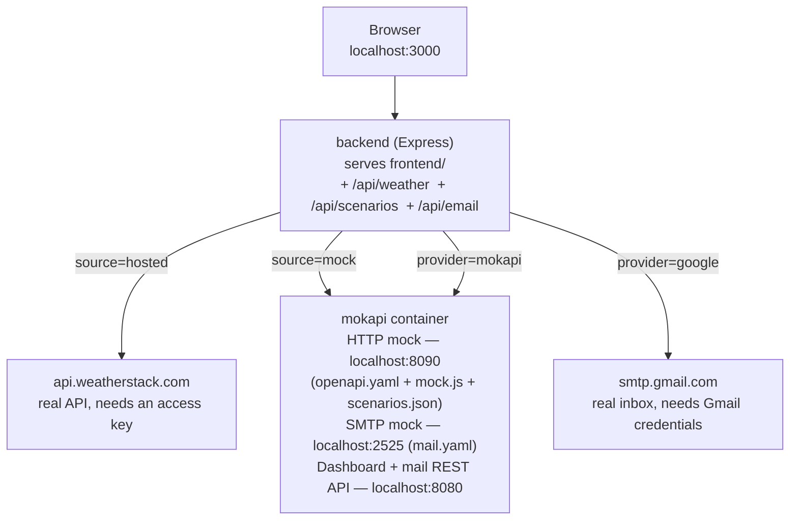

# Mokapi Mocking Demo

A small demo of [mokapi](https://mokapi.io/): a local, spec-driven mock
server that stands in for real third-party services, instead of hand-rolling
fake servers and poking them with Postman. One UI, two tabs, each mocking a
different protocol, each toggleable against the real thing:

- **REST API tab** — [weatherstack](https://docs.apilayer.com/weatherstack/docs/weatherstack-api-v-1-0-0)'s
  "current weather" endpoint, mocked from an OpenAPI spec, vs. the real
  hosted API.
- **Email tab** — SMTP email, mocked by mokapi's built-in mail server, vs.
  real Gmail SMTP.

## Why this matters

This repo exists to make a case for a practice, not for a particular tool.
mokapi is just what's used here to make the idea concrete enough to try.
The practice: local and test environments should talk to a controlled,
spec-driven mock of a dependency, not to that dependency's hosted
instance.

- **Test environments shouldn't depend on production.** Pointing local dev
  or test at a real third party — or at your own production systems — means
  every test run has a real side effect (a real email sent, a real quota
  spent) and is only as reliable as someone else's uptime. A mock removes
  that dependency entirely: nothing leaves your machine, nothing costs
  anything, nothing can be down or rate-limited.
- **You can't test what you can't trigger.** How do you check that your app
  handles an error response, a malformed payload, or an edge-case value, if
  you can't make the real dependency produce that on demand? A mock lets you
  script the exact scenario you need, instantly and repeatably, instead of
  waiting for a real failure to happen to you.
- **Testing a scenario shouldn't require a developer or a deploy.** In this
  demo, adding a new test case is a form in a browser — no code change, no
  restart, nothing to ship. That's the difference between "mocking is
  technically possible" and "mocking is something the whole team, QA
  included, actually reaches for."
- **A mock is only trustworthy if it can't drift from the real contract.**
  Hand-rolled fake-server code tends to quietly diverge from what the real
  API actually does over time. Generating the mock from the same spec
  (OpenAPI here) you'd hand to a consumer of the real API keeps the two
  honest with each other.
- **None of this is specific to mokapi.** Other tools take the same
  approach. What matters is the shift itself — from "point everything at the
  real thing and hope" to "mock what you don't control, on purpose."

## Architecture



The backend never exposes which source answered a weather lookup — it
normalizes both into the same `{status, ...}` shape before the frontend ever
sees it. Scenario saves from the UI write straight into
`mokapi/scenarios.json`, which both the backend (writer) and mokapi (reader)
see via the same bind-mounted host file, so there's no restart or polling
involved. For email, the same mokapi container also runs an SMTP mock
server (defined in `mokapi/mail.yaml`) alongside the HTTP mock — the backend
sends to it over real SMTP, and reads captured messages back through
mokapi's mail REST API.

## Demo script

The fastest way to see what this is about, in order:

1. **Look up "Chicago" with Mokapi selected.** You get "Success! City:
   Chicago, Temperature: 999°F" — an obviously fake number, which is the
   point: it proves the response came from the local mock, not a live
   weather service.
2. **Open the Mokapi Dashboard** (button top-right, or `localhost:8080`).
   Show the request you just made in the live log — this is the moment that
   makes the "we're not hand-rolling a fake server" pitch land: mokapi is a
   real service, generating real HTTP traffic, from a spec.
3. **Add a new scenario** in the UI for a city that doesn't exist yet:
   Response Code `400`, Error Code `615`, Error Info `Unable to geocode this
   location.`. Save it, then look that city up — you get the error rendering
   immediately, no restart.
4. **Open `mokapi/scenarios.json`** on disk and point out the scenario you
   just added is sitting there as plain JSON — nothing magic, no database.
5. **Toggle to Weatherstack (hosted)** and look up a real city (needs
   `WEATHERSTACK_ACCESS_KEY` set) to show the exact same UI, unmodified,
   working against the real API — same contract, same code path.
6. **Open `mokapi/openapi.yaml`** to close the loop: this one file is the
   entire contract driving the mock, and it's the same shape you'd hand a
   frontend team as documentation for the real API.
7. **Switch to the Email tab.** Send a message with **Mokapi** selected and
   watch the **Mokapi Inbox** panel fill in with the exact Subject/From/To
   and body mokapi's mock SMTP server received — real SMTP traffic, just
   like the REST tab's real HTTP traffic, visible in the same Mokapi
   Dashboard.
8. **Switch Send via to Google and resend** (needs `GMAIL_USER`/
   `GMAIL_APP_PASSWORD` set). The backend sends it for real via Gmail SMTP
   this time — check that email account's actual inbox to confirm the
   message arrived. Same UI, same form, same code path as step 7; only the
   destination changed. The Mokapi Inbox panel doesn't apply here, since
   nothing went through the mock.
9. **Open `mokapi/mail.yaml`** to show the mail-mocking contract is just as
   small and declarative as `openapi.yaml` was for REST.

## Prerequisites

- Docker Desktop (or another Docker Engine + Compose)
- A free [weatherstack](https://weatherstack.com/) access key — **only
  required if you want to try the REST API tab's "hosted" source**. The
  mock source works with no key at all.
- A Gmail address + App Password — **only required if you want to try the
  Email tab's "Google" option**. The "Mokapi" option works with no
  credentials at all.

## Adding your credentials

```bash
cp .env.example .env
```

Edit `.env` and set whichever of these you need — both are optional, and
each is independent of the other:

```
WEATHERSTACK_ACCESS_KEY=your-key-here
GMAIL_USER=you@gmail.com
GMAIL_APP_PASSWORD=your-16-character-app-password
```

`.env` is gitignored — credentials are only ever passed into the backend
container as environment variables, never baked into an image or committed.

### Getting a weatherstack access key

Only needed for the REST API tab's "Weatherstack (hosted)" source.

1. Go to [weatherstack.com](https://weatherstack.com/) and click **Get Free
   API Key** (or sign up via [apilayer.com](https://apilayer.com/), which
   also hosts weatherstack).
2. Verify your email and log in to the dashboard.
3. Copy the **API Access Key** shown there into `WEATHERSTACK_ACCESS_KEY`.
   The free tier is plenty for this demo (no card required, generous
   monthly request limit).

### Getting a Gmail App Password

Only needed for the Email tab's "Google (real SMTP)" option.

1. Turn on **2-Step Verification** on the Google account you want to send
   from, if it isn't already: [myaccount.google.com/security](https://myaccount.google.com/security) →
   **2-Step Verification**. App Passwords aren't available without this.
2. Go to [myaccount.google.com/apppasswords](https://myaccount.google.com/apppasswords).
3. Under **App name**, type something like `Mokapi Email Demo` and click
   **Create**.
4. Google shows a 16-character password (four groups of four letters, e.g.
   `abcd efgh ijkl mnop`) — copy it as-is (spaces are fine) into
   `GMAIL_APP_PASSWORD`.
5. Set `GMAIL_USER` to the full Gmail address of that same account (the one
   whose App Password you just generated) — this is both the SMTP login and
   the "from" address the demo sends as.

This is **not** your normal Gmail password, and can't be used to log into
the account itself — it only authorizes SMTP/IMAP access for this one app,
and can be revoked independently from the same App Passwords page at any
time without affecting your main password.

## Running it

```bash
docker compose up --build
```

Then open:

- **App**: http://localhost:3000
- **Mokapi dashboard**: http://localhost:8080 — watch live mock requests/responses in real time (both HTTP and mail)
- **Mokapi mock weather API directly**: http://localhost:8090/current
- **Mokapi mock SMTP server directly**: `localhost:2525` (any SMTP client)

## Using the UI

Use the **REST API** / **Email** tabs at the top to switch between the two
modules.

### REST API tab

1. Enter a US city and pick a source, then **Get Weather**.
   - On success you'll see a success message, the city name, and the
     temperature in Fahrenheit — nothing else.
   - On error (mock only returns 400s; hosted may return other codes) you'll
     see the HTTP status, the upstream error code, and the error info message
     — nothing else.
2. Use **Manage Test Scenarios** to define what the mock returns for a given
   city:
   - Pick **Response Code** `200` or `400` (default `200`).
   - `200` scenarios ask for **City Name** and **Temperature**.
   - `400` scenarios ask for **Error Code** and **Error Info**.
   - Saving writes the scenario straight into `mokapi/scenarios.json` — mokapi
     picks it up on the very next request, no restart required.
   - A city with no scenario defined falls back to a generic 70°F success
     response, so the mock never hard-fails on an unrecognized city.
   - Saving shows a brief "Saved scenario for…" confirmation, and the table
     updates immediately with color-coded response-code badges.
   - Click any row in the table to load that scenario back into the form for
     editing — rows highlight on hover to show they're clickable. Saving
     again overwrites that same city's scenario (keys are lowercased city
     names, so this is always an update-in-place, never a duplicate).

The repo ships with one seeded scenario: `chicago` → 200, temperature 999°F.

### Email tab

1. Enter a **To** address, write a **Body**, pick **Mokapi** or **Google**
   under **Send via**, then **Send**.
2. With **Mokapi** selected, the message is sent over real SMTP to mokapi's
   local mock server — nothing leaves your machine. The **Mokapi Inbox**
   panel below then automatically checks mokapi's mail API for the message
   it just captured and displays the raw Subject/From/To/body in a
   plain-text, monospaced box. Use **Refresh** to re-check manually (e.g. if
   you switch the **To** address).
3. With **Google** selected, the message is sent for real via Gmail SMTP
   using `GMAIL_USER`/`GMAIL_APP_PASSWORD` from `.env` — check the actual
   inbox at that address to see it arrive. The Mokapi Inbox panel doesn't
   apply here, since nothing went through the mock.

## Manual scenario editing

`mokapi/scenarios.json` is a plain JSON flat file, keyed by lowercased city
name:

```json
{
  "chicago": { "responseCode": 200, "cityName": "Chicago", "temperature": 999 },
  "miami": { "responseCode": 400, "errorCode": 615, "errorInfo": "Unable to geocode this location." }
}
```

You're welcome to hand-edit this file directly instead of using the UI —
mokapi re-reads it on every request, so changes are picked up immediately
with the containers still running.

## Known limitation: hosted error detection

The backend classifies a response as success/error purely by HTTP status
code (2xx vs. everything else), matching the stated acceptance criteria.
Some APIs in the apilayer family have, in the past, returned HTTP 200 with a
`success: false` body even for error cases. If weatherstack's hosted API
ever does that, the hosted path in this demo would misread it as a success.
The mock path is unaffected, since mokapi is explicitly told to return a
literal 200 or 400. If you hit this in practice, the fix is a small change
to `backend/src/normalize.js` to also check `body.success === false`.

## Troubleshooting

- **`GET http://localhost:8090/` returns 404.** Expected — mokapi's mock
  only defines `/current` (per `mokapi/openapi.yaml`), not a root route. The
  app itself is on `localhost:3000`; port 8090 is the raw mock API for
  `/current` requests only.
- **Mock lookups always return the generic 70°F fallback, even for a city
  you've defined a scenario for.** Check the mokapi container logs
  (`docker compose logs mokapi`). This previously happened here due to a
  script bug (see [CLAUDE.md](CLAUDE.md#gotchas-hit-during-initial-verification))
  — if `mock.js` has been edited since, that's the first place to look.
- **Hosted lookups fail immediately.** Confirm `.env` has
  `WEATHERSTACK_ACCESS_KEY` set and that `docker compose` picked it up
  (`docker compose config` will show the resolved value).
- **Port already in use.** 3000, 8080, 8090, or 2525 already bound locally?
  Change the host-side port in `docker-compose.yml` (left side of the
  `"host:container"` mapping) — no code changes needed.
- **Mokapi Inbox always shows "No message captured yet", even right after a
  successful Mokapi send.** First hit **Refresh** once or twice — local
  delivery is near-instant but not synchronous with the send response. If it
  never appears, check `docker compose logs mokapi` for SMTP errors, and
  confirm `MOKAPI_MAIL_SERVICE_TITLE` in `docker-compose.yml` still matches
  `info.title` in `mokapi/mail.yaml` exactly (`Mokapi Email Demo`) — a
  mismatch makes every inbox lookup silently come back empty.
- **Google send fails immediately with a credentials error.** Confirm
  `.env` has both `GMAIL_USER` and `GMAIL_APP_PASSWORD` set, and that the
  app password (not your regular Gmail password) was generated at
  [myaccount.google.com/apppasswords](https://myaccount.google.com/apppasswords).

## Project layout

```
backend/    Express API + static frontend host
frontend/   Native HTML/CSS/JS UI, no build step, tabbed REST API / Email pages
mokapi/     OpenAPI spec + JS scenario handler + scenarios.json (REST mock),
            mail.yaml (SMTP mock)
```

See [CLAUDE.md](CLAUDE.md) for the internal contract and file-by-file notes.

## License

MIT — see [LICENSE](LICENSE). This is a one-off demo and isn't actively
maintained beyond it.
